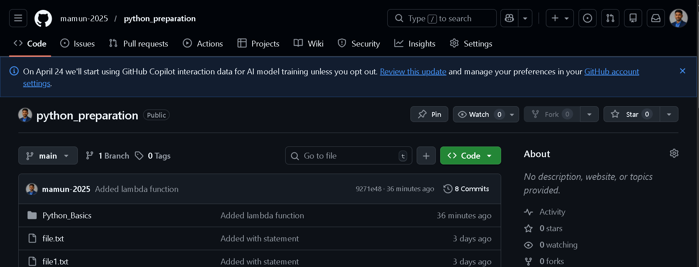

## 📘 Python Fundamentals & Interview Preparation
This repository contains my structured learning and practice of Python fundamentals, covering essential concepts required for backend development and technical interviews.

- 💡 This repository is part of my daily backend development preparation.

---

# 🚀 Topics Covered
This repository includes hands-on examples of:
- Variables & Data Types
- Indentation & Syntax
- Mutable vs Immutable Objects
- List, Tuple, Set, Dictionary
- Lambda Function
- *args and **kwargs
- Exception Handling
- Pass by Value vs Reference
- With Statement(Context Manager)

---

# 📂 File Structure
assets
├── screenshot.png
Python_Basics/
│
├── args_kwargs.py
├── exception_handling.py
├── indentation.py
├── lambda_function.py
├── list_comprehension&dic_comprehension.py
├── list_tuple_set_dictionary.py
├── mutable&immutable.py
├── pass_by_value&pass_by_reference.py
├── python.py
├── variable_type.py
└── with_statement.py

---

# 💡 Purpose of This Repository
- Strengthen core Python concepts
- Prepare for coding inerviews
- Build strong foundation for backend development(Django/API)

---

# 🛠️ How to Run
Clone the repository:
- git clone https://github.com/mamun-2025/python_preparationpython_preparation.git

Navigate to the folder:
- cd python_preparation/Python_Basics

Run any file:
- python filename.py

---

# 🧠 Key Learning
While practicing, I focused on:
- Writing clean and readable Python code
- Understanding how Python handles memory (mutable vs immutable)
- Improving problem-solving thinking 
- Preparing for real interview questions

---

# 🚀 Next Goal
- Advanced Python (OOP, Generators, Decorators)
- Django REST Framework(DRF)
- Real-world backend system design

---

# ⭐ Support
If you find this helpful, consider giving it a ⭐ on GitHub!

---

# 📸 Screenshots

---

## 👨‍💻 Author

**Mamun Bepari**  
Backend Developer (Python | Django)

- 🔗 GitHub: https://github.com/mamun-2025 
- 💼 LinkedIn: https://www.linkedin.com/in/mamun-bepari-8b367a378/